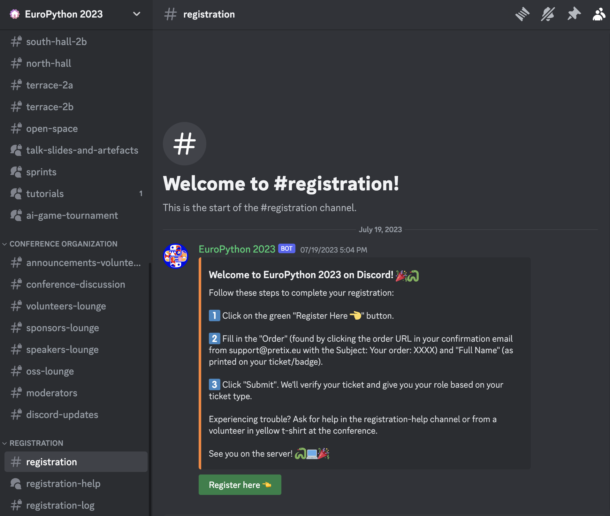

> [!NOTE]
> This is a fork from the EuroPython Discord Bot. For more information
> check [their repository](https://github.com/europython/discord).

# PyLadiesCon Discord Bot

An easy to deploy conference bot that manages roles for attendees via registration, notifies about
upcoming sessions.
Exposes Discord server statistics to organizers.
We hosted the bot on Hetzner. And deployed with a single click Action from GitHub 😎.



## Differences with the EuroPython bot

- This bot doesn't use ansible for the deployment step, but it's running on a VPS.
- The EuroPython conference rely on having 1-YouTube link per room per day, but PyLadiesCon
  will have 1-YouTube link per talk, so the configuration will not work out of the box.

> [!NOTE}
> Please notice that a `.secrets` and a `PyLadiesBot/config.local.toml` files are needed
> in order to make the bot work. This files are not tracked.

## TODO

- Adapt [programapi](https://github.com/EuroPython/programapi/) to generate the pretalx json files.
  This is again different from EuroPython's approach, because the pretalx configuration is different
  in both conferences.
- Adapt livestreams.toml to handle the usage of the YouTube link from the "Internal notes" field
  from pretalx,
- Adapt the `program_notification` to link Voice channels instead of youtube links

## Overview

The `main` method in `PyLadiesBot/bot.py` is the entry point for the bot. I't a good starting point
to start browsing the codebase. It requires a `.secrets` file in the root of the repository with
`DISCORD_BOT_TOKEN` and `PRETIX_TOKEN` environment variables.

The API server is used to send events __to__ the bot (such as events from the PyLadies portal).
To run it, run `fastapi dev PyLadiesBot/api_server/main.py`. It uses the same configuration and secrets as the main bot.

### Registration

At PyLadiesCon, we use [pretix](https://pretix.eu/about/en/) as our ticketing system.

The bot utilizes the Pretix API to fetch ticket information and creates an in-memory key-value store
to retrieve the ticket type for a given Discord user. The mapping between ticket types and Discord
roles is defined in a JSON file, such as `ticket_to_roles_prod.json`, and is used by the bot to assign
roles to users.

There are safeguard methods in place to prevent users from registering multiple times and to make a
direct Pretix API call in case the user information is not available in the in-memory store.


### Program notifications

Is a service to push the programme notification to Discord. Pretalx API is used to fetch the
programme information, and `config.toml` holds information about livestream URLs.

### Organizers extension

A set of commands that are available only for organizers that are allowing to get statistics about
the Discord server.

## Setup
### Install Python, Pipenv, Pyenv (Ubuntu)
```shell
# dependencies of readline, sqlite3, ctypes
sudo apt install libreadline-dev libsqlite3-dev lzma libbz2-dev liblzma-dev

# python, pip
sudo apt install python3 python3-pip

# pyenv
curl https://pyenv.run | bash
pyenv install 3.11.4

echo 'export PYENV_ROOT="$HOME/.pyenv"' >> ~/.bashrc
echo '[[ -d $PYENV_ROOT/bin ]] && export PATH="$PYENV_ROOT/bin:$PATH"' >> ~/.bashrc
echo 'eval "$(pyenv init -)"' >> ~/.bashrc
. ~/.bashrc

# pipenv
python3 -m pip install pipenv
echo 'alias pipenv="python3 -m pipenv"' >> ~/.bashrc
. ~/.bashrc
```

### Using pipenv
This is a summary of useful pipenv commands.
Please refer to the [pipenv documentation](https://pipenv.pypa.io/en/latest/) for details.

```shell
# generate venv from Pipfile.lock
pipenv install
pipenv install --dev  # include dev dependencies

# activate pipenv-generated venv
pipenv shell

# reset all packages to versions pinned in Pipfile.lock
pipenv sync
pipenv sync --dev  # include dev dependencies

# install package and update all other packages
pipenv install package
pipenv install --dev package  # install as dev dependency

# upgrade only specific package without updating all other packages
pipenv upgrade package
pipenv upgrade --dev package  # upgrade as dev dependency

# remove package and update all other packages
pipenv uninstall package

# remove only specific packages without updating all other package
# [impossible]
```

### Clone repo, install dependencies, run tests
```shell
# clone repo, install dependencies
git clone https://github.com/pyladies/global-conference-infra/ pyladiescon-infra
cd pyladiescon-infra/discord

# install dependencies
pipenv install --dev

# run linting and tests
pipenv run black --check .
pipenv run isort --check .
pipenv run flake8 .
pipenv run pytest .
```

### Configuration
Create `config.local.toml` file in PyLadiesBot directory, it would be used instead of `config.toml`
if exists.

Add `.secrets` file to the root of the repository with the following content:
```shell
DISCORD_BOT_TOKEN=<PyLadiesConTestBotToken>
PRETIX_TOKEN=<PretixStagingToken>
BOT_API_TOKEN=<BotAPIServerToken>
````
After you have added the `.secrets` file, you can run the bot with the following command:
```shell
pipenv run python PyLadiesBot/bot.py
```
or with docker:
```shell
docker build --tag discord_bot .
docker run --interactive --tty --env DISCORD_BOT_TOKEN=$DISCORD_BOT_TOKEN --env PRETIX_TOKEN=$PRETIX_TOKEN discord_bot
```
